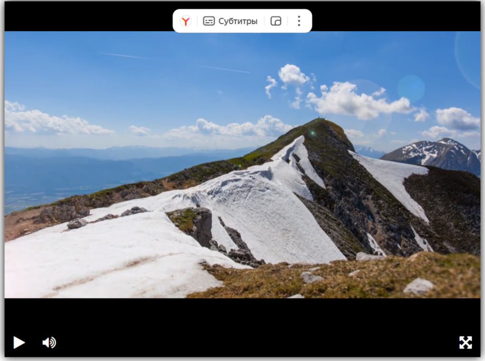

# Видеоплеер

Проект представляет из себя простенький [видеоплеер](https://vihrkraft.github.io/Video-player/dist/).



[Демоверсия плеера](https://github.com/devmanorg/video-player-jslib)

### Как установить

Python c версией 3.12 должен быть уже установлен. 
Затем используйте `pip` (или `pip3`, есть конфликт с Python2) для установки зависимостей:
```
pip install -r requirements.txt
```

### Как запустить

Для запуска программы необходимо написать следущее:
```
livereload dist
```

Либо зайдите в корневую папку проекта => `dist` => `index.html`

### Цель проекта

Код написан в образовательных целях на онлайн-курсе для веб-разработчиков [dvmn.org](https://dvmn.org/).